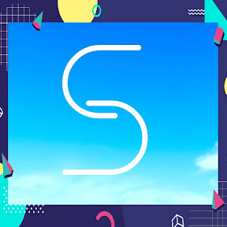

<p align="center">
  
</p>

<p align="center">
  <a href="https://github.com/metagg2/skybot-rust/issues"></a>
  <a href="https://github.com/metagg2/skybot-rust/network"></a>
  <a href="https://github.com/metagg2/skybot-rust/stargazers"></a>
  <a href="https://deps.rs/repo/github/metagg2/skybot-rust"></a>
  <a href="https://github.com/MetaGG2/SkyBot-Rust/blob/main/LICENSE"></a>
</p>

# Disclaimer

In it's current form, not everything works as intended. That is why this is a pre-release.


# Requirments

## Rust

Make sure you have Rust installed. I am using 1.65.0. If you don't have Rust installed, then [install it from here](https://www.rust-lang.org/tools/install). If you are not familiar with rust, then take a look at [The Rust Book](https://doc.rust-lang.org/stable/book/) and [The Cargo Book](https://doc.rust-lang.org/cargo/index.html).

## Other Requirements

To run this, you only need FFmpeg, Opus, and yt-dlp. If you want to build, then you also need a C compiler. yt-dlp is installed via `pip`, so make sure you download Python.

## Running

Whether running the executable attached, or building it yourself, you must have a `config.json` file with your bot token in it like: `{ "token": "your token here" }`. Optionally, if you have a "test bot" that is used for testing purposes, you can also add another value in your `config.json` file like: `{ "token": "main bot token", "test-token": "test bot token" }`. In order to use this testing feature, run your bot with the following argument.

```shell
cargo run -- t
```

